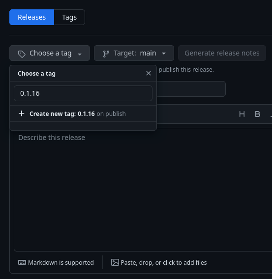

# How to release

Follow this document to make new Phenopacket store release.

## Release checklist

1. Start on `main` branch
2. Ensure `main` branch is clean with no uncommitted changes
3. If required, install [phenopacket-store-toolkit](https://github.com/monarch-initiative/phenopacket-store-toolkit)
    ```shell
    python3 -m pip install phenopacket-store-toolkit[release]
    ```
4. Generate release archives with `ppktstore` CLI. 
   For instance, run following to generate a release `0.1.16`:
    ```shell
    python3 -m ppktstore package --notebook-dir notebooks --release-tag 0.1.16 --output all_phenopackets
    ```
  
    This will pack all phenopackets found in `notebooks` folder into `all_phenopackets.zip` ZIP file. 
    The ZIP file includes a top-level folder that corresponds to the used release tag (e.g. `0.1.16` in this case).
5. Run the `PhenopacketStoreStats` notebook to update the stats
6. Commit the changes in the notebook
7. Push the commits to GitHub
8. Go to [Releases](https://github.com/monarch-initiative/phenopacket-store/releases) and click on *Draft a new release* button to start making a new release
9. Click on *Choose a tag* dropdown, type the release in (e.g. `0.1.16`), and click on *Create new tag on publish* (**IMPORTANT!**)
  
10. Click on *Generate release notes* button to add what's changed into the release notes
11. Attach the release archive generated in the 4th step by dragging it into the area located below the release notes
12. Click *Publish release* to make the release


Done!
